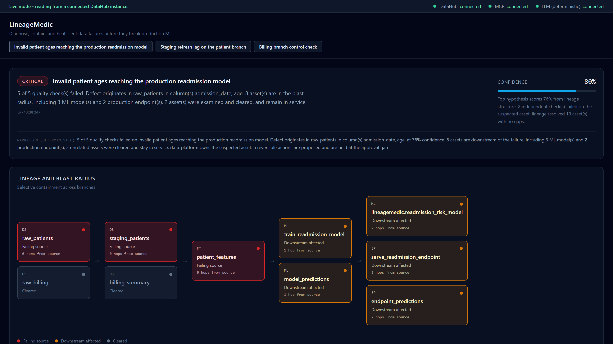
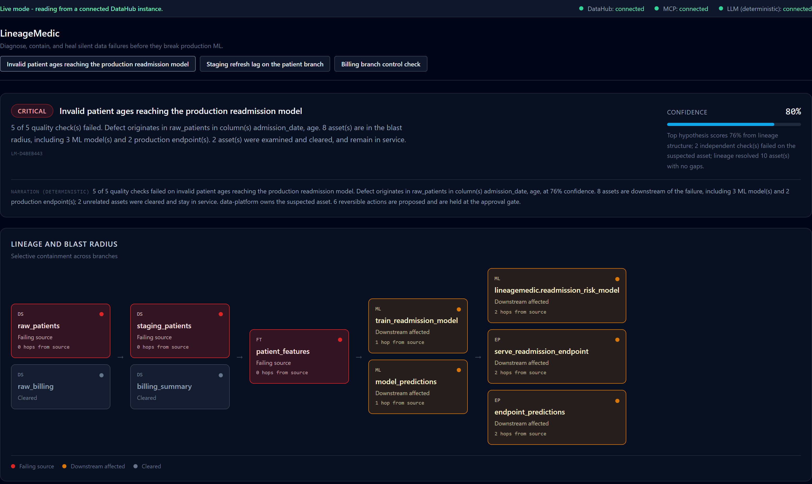
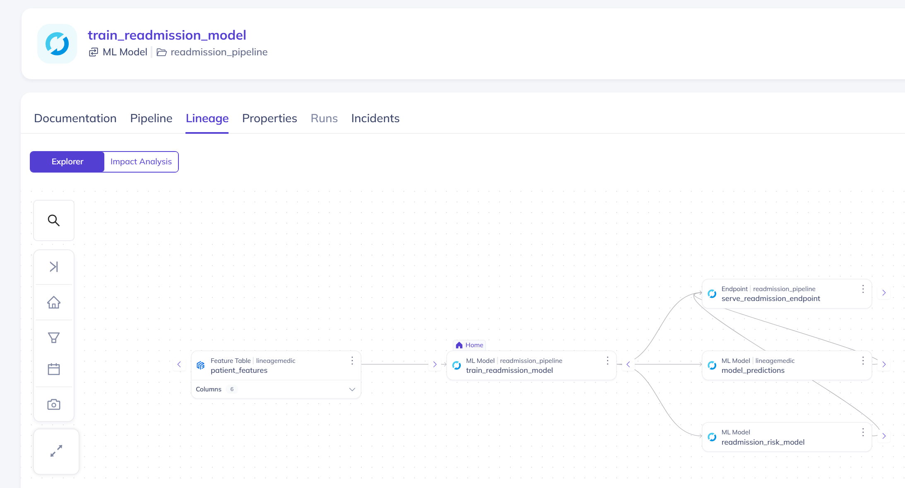
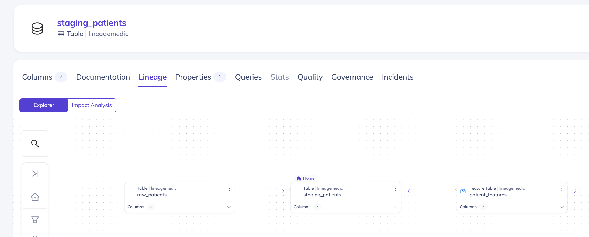
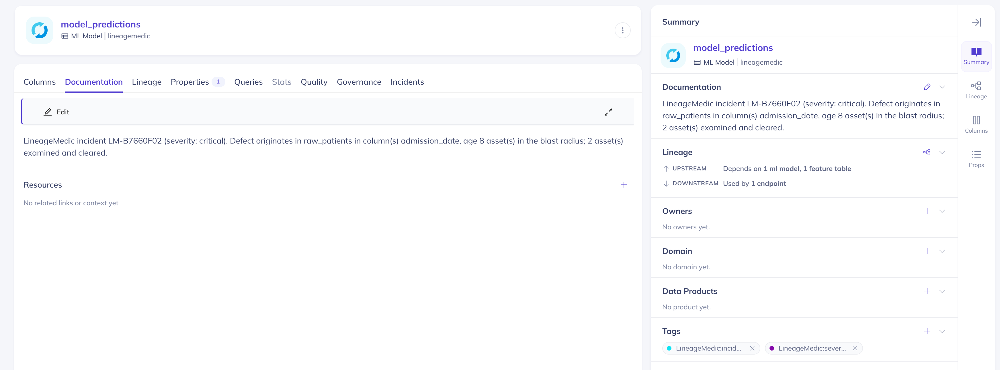
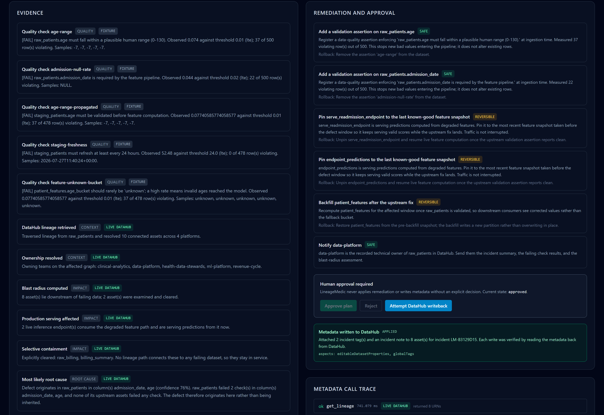
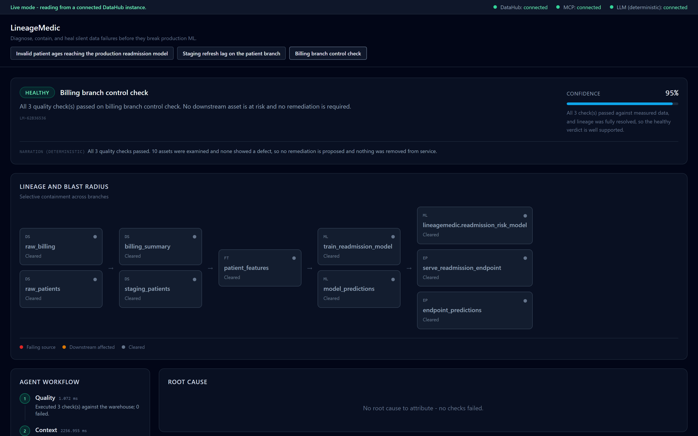

# LineageMedic

**Diagnose, contain, and heal silent data failures before they break production ML.**

[](https://github.com/fokrulanthro16-eng/lineagemedic/actions/workflows/ci.yml)
[](LICENSE)
[](https://www.python.org/downloads/release/python-3110/)
[](https://datahubproject.io/)

Built for **Build with DataHub: The Agent Hackathon** — Production ML Agents.

A silent data failure is the kind that does not raise an alarm. No pipeline
crashes, no job goes red, no page fires. A column starts carrying impossible
values, a refresh quietly falls behind, and the model keeps serving predictions
built on top of it. By the time anyone notices, the question is no longer "what
broke" but "what has this been contaminating, and for how long".

LineageMedic answers that question with evidence. Seven agents run in order:
they measure a real warehouse, walk the real lineage graph in DataHub to find
where the defect entered and what it reaches, propose a reversible remediation
plan, and — only after a human approves — write the findings back to the
catalog and verify them by reading them out again.



*A critical incident: 5 checks failed, 8 assets in the blast radius, root cause
localised to `raw_patients.age` at 76% confidence, and 2 assets explicitly
cleared. Every panel is derived from measurements — nothing here is declared.*

---

## Table of contents

- [What it does](#what-it-does)
- [See it working](#see-it-working)
- [Why this is not a rules engine with a dashboard](#why-this-is-not-a-rules-engine-with-a-dashboard)
- [Architecture](#architecture)
- [The seven agents](#the-seven-agents)
- [How DataHub is used](#how-datahub-is-used)
- [Scenarios](#scenarios)
- [Quickstart](#quickstart)
- [Running against a real DataHub](#running-against-a-real-datahub)
- [Honesty guarantees](#honesty-guarantees)
- [What DataHub v1.6.0 forced](#what-datahub-v160-forced)
- [Testing](#testing)
- [Repository layout](#repository-layout)
- [Development](#development)
- [Known limitations](#known-limitations)
- [Documentation](#documentation)
- [Status](#status)
- [License](#license)

## What it does

Given a warehouse and a catalog, LineageMedic produces a complete incident
diagnosis in a few seconds:

- **Measures** quality checks against a real SQLite warehouse — range
  violations, nullability, freshness — reporting observed values against
  thresholds, with sample offending rows.
- **Resolves context** from DataHub over GraphQL: schema, owners, and the
  lineage graph around the failing asset.
- **Computes a blast radius** by walking that graph, separating assets that are
  genuinely downstream of failing data from assets that merely sit nearby.
- **Localises the root cause** by asking which failing asset has no failing
  upstream, and ranks the competing hypotheses with confidence scores.
- **Proposes a remediation plan** where every step carries a rollback.
- **Classifies each step** as safe, reversible, or requiring approval.
- **Writes back to DataHub** — tags and an incident note — only after a human
  approves, then verifies each write by reading the metadata back.

> ### Two modes, and every response says which one produced it.
>
> **Live mode** (`LINEAGEMEDIC_MODE=live`) talks to a real DataHub OSS instance:
> it reads lineage and metadata over DataHub's GraphQL API and, once a human
> approves, writes tags and descriptions back and verifies them by reading them
> out again. Responses carry `context_source: "live_datahub"`.
>
> **Fixture mode** is the default fallback and runs against committed fixtures
> and a local SQLite warehouse, with no DataHub required. Every response is
> labelled: `context_source: "fixture"`, a persistent banner in the dashboard,
> and an approved writeback returns `skipped_fixture_mode` rather than reporting
> a success that never happened.
>
> Live mode never silently degrades — if DataHub is unreachable it reports the
> failure instead of quietly serving fixtures.

## See it working

Every screenshot below was captured from the running application and a real
local DataHub instance. None is mocked or edited.

### Containment is selective

The hardest thing to get right is *not* flagging everything. The billing branch
shares an upstream ancestor with the failing patient branch, and is still
correctly left in service.



### The lineage is real, in DataHub's own UI

`train_readmission_model` in DataHub, showing the three downstream entities the
blast radius calculation depends on:



And the upstream chain the root-cause agent walks back through:



### The writeback is real, and verified

After approval, LineageMedic writes an incident note and tags to each affected
asset, then reads them back. This is `model_predictions` in DataHub afterwards:



### Nothing is written without a human decision

The approval gate, and the receipt naming the exact aspects that were written:



### It does not invent incidents

The control scenario reports healthy, clears all ten assets, and explicitly
attributes no root cause:



## Why this is not a rules engine with a dashboard

Three design decisions carry the project.

**Severity is derived, never declared.** A scenario describes a situation; it
does not get to announce how bad it is. Severity falls out of the measurements
— how many checks failed, whether the blast radius reaches a production
endpoint. The scenarios record an `expected_severity`, and `scripts/demo.ps1`
compares it against what the workflow actually derived, printing `MISMATCH` if
they diverge. The demo is a live assertion, not a slideshow.

**Provenance is a type, not a convention.** Every object derived from metadata
carries a `DataSource` enum (`LIVE_DATAHUB` or `FIXTURE`). It is a required
field, so there is no code path that produces a lineage result without
recording where it came from. That is what makes the fixture-mode labelling
structural rather than a string someone remembered to add.

**The approval gate is enforced three times.** The Safety agent classifies the
action, the Writeback agent refuses to act on an unapproved plan, and the HTTP
endpoint returns 403. Each layer is independently tested, because a gate that
exists in one layer is a gate that a refactor can remove.

## Architecture

```
                    ┌──────────────────────────────────┐
                    │   React + TypeScript dashboard   │
                    │   types generated from OpenAPI   │
                    └────────────────┬─────────────────┘
                                     │ HTTP
                    ┌────────────────▼─────────────────┐
                    │        FastAPI  (apps/api)       │
                    │  approval gate · audit · status  │
                    └────────────────┬─────────────────┘
                                     │
                    ┌────────────────▼─────────────────┐
                    │   Workflow  (7 agents, ordered)  │
                    │                                  │
                    │  Quality → Context → Impact →    │
                    │  Root Cause → Remediation →      │
                    │  Safety → Writeback              │
                    └───────┬──────────────────┬───────┘
                            │                  │
                  MetadataPort (read)   WritebackPort (write)
                            │                  │
            ┌───────────────▼──────┐   ┌───────▼───────────────┐
            │  Fixture adapter     │   │  Fixture adapter      │
            │  (default)           │   │  → skipped_fixture    │
            ├──────────────────────┤   ├───────────────────────┤
            │  DataHub MCP adapter │   │  DataHub SDK adapter  │
            │  (live mode)         │   │  (live mode)          │
            └──────────────────────┘   └───────────────────────┘
```

The two ports are `typing.Protocol` definitions. The workflow depends on those
interfaces and never on a concrete adapter, which is what made the DataHub phase
an addition rather than a rewrite: the live adapters implement the same
protocols and get injected at the composition root in
[apps/api/lineagemedic_api/main.py](apps/api/lineagemedic_api/main.py).

Reads and writes are deliberately separate protocols. Reading the catalog is
safe and happens on every diagnosis; writing mutates shared state that other
teams depend on. A single interface would let a future change acquire write
capability implicitly.

## The seven agents

Each agent consumes the previous agents' evidence and contributes typed output.
None of them calls an LLM to reach a conclusion.

| # | Agent | Question it answers |
|---|-------|---------------------|
| 1 | Quality | Which checks fail, on which columns, by how much? |
| 2 | Context | What does the catalog know about these assets — schema, owners, lineage? |
| 3 | Impact | What is downstream, and does it reach a model or a production endpoint? |
| 4 | Root Cause | Where did the defect enter, and what is the competing hypothesis? |
| 5 | Remediation | What should be done, in what order, and what is the rollback? |
| 6 | Safety | Which of those steps mutate shared state and therefore need approval? |
| 7 | Writeback | Record findings to the catalog — refusing unless approval was granted. |

The order is a genuine dependency chain, not a presentation sequence. Impact
cannot run before Context has resolved the graph; Remediation cannot be proposed
before a root cause is identified.

An optional Ollama narrator can rewrite the summary in plainer language. It runs
**after** the diagnosis is complete and cannot alter severity, evidence, root
cause, or the plan. If it is absent, slow, or wrong, the diagnosis is
byte-identical. **The demo does not depend on any LLM being available.**

## How DataHub is used

DataHub is not a logo on a slide here — it is the source of every structural
conclusion the tool draws.

| Capability | How LineageMedic uses it |
|------------|--------------------------|
| GraphQL search | Resolve a scenario's assets to real catalog URNs |
| `entity.lineage` traversal | Walk upstream to localise the defect, downstream to compute the blast radius |
| Schema metadata | Report which columns failed and what type they are |
| Ownership | Name the team to notify for each affected asset |
| Subtypes | Distinguish an ML model from a serving endpoint — severity is derived from these counts |
| `globalTags` | Tag affected assets with the incident ID and derived severity |
| `editableDatasetProperties` | Attach the incident note describing root cause and blast radius |

Without the lineage graph, the tool could report that a column is bad but not
what it contaminates. Without the subtypes, a critical incident silently
downgrades to a warning. The catalog is load-bearing.

## Scenarios

| Scenario ID | Derived severity | What it demonstrates |
|-------------|------------------|----------------------|
| `critical-age-corruption` | critical | Impossible ages in `raw_patients` propagate through staging and features into the deployed readmission model. |
| `warning-staging-staleness` | warning | A refresh lag that has not yet corrupted anything, but is trending toward it. |
| `healthy-billing-branch` | healthy | The billing branch is examined and cleared, proving containment is selective rather than a blanket alarm. |

The healthy scenario is the one that matters most. A tool that flags everything
during an incident is not diagnosing; the billing branch shares an upstream
ancestor with the failing assets and is still correctly left in service.

## Quickstart

Requires Python 3.11 (`py -3.11`) and Node 20+. No Docker, no cloud account, no
API key — fixture mode is the default and needs no infrastructure.

```powershell
.\scripts\setup.ps1     # venv, dependencies, seeded warehouse, generated types
.\scripts\start.ps1     # backend on :8000, dashboard on :5173
.\scripts\demo.ps1      # drive all three scenarios through the API
.\scripts\test.ps1      # ruff, mypy, pytest, tsc, vitest
.\scripts\stop.ps1      # stop both services
```

Then open <http://localhost:5173> and pick a scenario.

`start.ps1` records each process ID with its start time, and `stop.ps1`
re-validates that start time before killing anything — Windows recycles PIDs,
and a stale PID file must never be able to terminate an unrelated process.

## Running against a real DataHub

Live mode has been exercised end to end against DataHub OSS v1.6.0.

```powershell
# 1. Start DataHub OSS. The override supplies the token-service signing key
#    that `datahub docker quickstart` would normally inject; see the file's
#    header for why it is needed and why the key is safe to commit.
docker compose -p datahub `
  -f $HOME\.datahub\quickstart\docker-compose.yml `
  -f docker\datahub-quickstart.override.yml up -d

# 2. Ingest the lineage. Needs the DataHub SDK, which pins a dependency tree
#    of its own and so lives in a separate Python 3.11 environment.
.venv-datahub\Scripts\python.exe scripts\ingest_lineage.py

# 3. Run the API against it.
$env:LINEAGEMEDIC_MODE = "live"
$env:DATAHUB_GMS_URL   = "http://localhost:8080"
.\scripts\start.ps1
```

The DataHub UI is then at <http://localhost:9002>.

The ingested graph is two deliberately disconnected branches — a patient chain
from `raw_patients` through to the served predictions, and an independent
billing branch. Containment is a real property of the graph, not an assertion in
the UI: a patient incident must leave billing untouched, and the integration
suite fails if the two branches ever become reachable from each other.

## Honesty guarantees

The project is built so that a fabricated success is difficult to produce by
accident and impossible to produce quietly.

- **No fake writebacks.** In fixture mode an approved writeback returns
  `status: "skipped_fixture_mode"` with an explanatory note. The dashboard
  renders that as *"No writeback performed - fixture mode"*.
- **No inferred connections.** The dashboard reports DataHub connectivity from
  the backend's `datahub_connected` field. It never concludes a connection
  exists because data happens to be present.
- **No silent degradation.** In live mode an unreachable DataHub is reported as
  a failure. The API never falls back to fixtures while claiming to be live.
- **No invented assets.** The live adapter checks DataHub's `exists` flag and
  raises for an unknown URN, so a caller can tell "the catalog has no such
  asset" from "the catalog was unreachable". It never fills a gap with fixture
  data.
- **No destroyed metadata.** A writeback merges into the tags already on an
  entity. If the current tags cannot be read, the adapter raises rather than
  writing, because DataHub's `globalTags` is a whole-aspect replace and a failed
  read would otherwise silently delete every existing tag.
- **No hand-written examples.** `examples/*.json` are captured from real
  workflow runs by `scripts/export_examples.py`, and CI regenerates and diffs
  them, so they cannot describe behaviour the code lacks.
- **No drifting types.** The frontend's types are generated from the OpenAPI
  schema, which is generated from the Pydantic models. CI fails if the
  committed artifacts are stale.
- **No secrets.** Tokens are read from the environment, never logged, and the
  status endpoint reports only whether a token is configured — never its value.

## What DataHub v1.6.0 forced

Four constraints were established by probing a running instance. Each is
documented with its evidence at the point in the code it shaped.

- **ML entities cannot carry dataset lineage.** `upstreamLineage` on `mlModel`
  is rejected with HTTP 422 (*"Unknown aspect upstreamLineage for entity
  mlModel"*), and the reverse — a dataset naming an `mlModel` as its upstream —
  is rejected too (*"Invalid format for aspect: dataset"*), because
  `upstreams[].dataset` is a dataset-typed field. The chain is therefore bridged
  by `dataJob` entities and their output datasets.
- **A model links to lineage through jobs, not datasets.** `mlModelProperties`
  accepts `trainingJobs` and `downstreamJobs`, producing `TrainedBy` and
  `UsedBy` edges. Without them the model page renders with no lineage at all.
  Note `searchAcrossLineage` does not follow these edges but the UI's
  relationship-based `entity.lineage` resolver does — which is why the browser
  shows the connection and a hop-count traversal does not.
- **Downstream traversal does not follow dataset→job edges.** Those are
  `Consumes`; only `DownstreamOf` is traversed. Each bridge output dataset
  therefore also carries an `UpstreamLineage` aspect.
- **Subtypes carry the domain meaning.** The bridge entities are a `DATA_JOB`
  and a `DATASET` to DataHub. Only their emitted subtype marks one as a model
  and the other as an endpoint — and since severity is derived from those
  counts, classifying on entity type alone silently downgraded a critical
  incident to a warning.

Full detail in [docs/ARCHITECTURE.md](docs/ARCHITECTURE.md).

## Testing

```powershell
.\scripts\test.ps1                  # every gate
.\scripts\test.ps1 -BackendOnly     # ruff, mypy, pytest
.\scripts\test.ps1 -Coverage        # with coverage reports
```

Current state, all measured by running the commands above:

| Gate | Result |
|------|--------|
| `pytest` | 96 passed (81 without a live DataHub, 15 skipped) |
| — of which live DataHub integration tests | 15 passed |
| `vitest` | 28 passed across 4 files |
| `ruff check .` | clean |
| `mypy` | clean, 31 source files (36 when `test.ps1` includes the tests) |
| `check_api_types.ps1` | frontend types in sync |

The integration tests skip themselves when no DataHub is reachable, so the
default suite stays runnable with nothing installed:

```powershell
$env:LINEAGEMEDIC_MODE = "live"; $env:DATAHUB_GMS_URL = "http://localhost:8080"
.venv\Scripts\python.exe -m pytest tests\test_datahub_integration.py
```

They cover the parts that only a live instance can prove: that lineage traverses
the full chain, that the blast radius reaches an ML model and a production
endpoint by kind, that an unapproved writeback mutates nothing, and that an
approved one is verified by reading the metadata back out of DataHub.

## Repository layout

```
packages/lineagemedic/     Core library: models, agents, workflow, adapters
apps/api/                  FastAPI application
apps/web/                  React + TypeScript + Vite dashboard
scripts/                   PowerShell lifecycle scripts and Python generators
examples/                  Real captured diagnoses (critical, warning, healthy)
skills/                    Reusable incident-response skill
docs/                      Architecture, demo script, judge guide, screenshots
tests/                     Backend test suite
```

## Development

```powershell
.\scripts\check_api_types.ps1       # fail if the API contract is stale
```

After changing any API response model, run `check_api_types.ps1` and commit the
regenerated `scripts/openapi.json` and `apps/web/src/api/schema.ts`.

See [CONTRIBUTING.md](CONTRIBUTING.md) for the full workflow.

## Known limitations

Stated plainly rather than omitted:

- **One lineage hop is not expressible.** `readmission_risk_model →
  model_predictions` cannot be written in DataHub v1.6.0 — both directions are
  rejected with HTTP 422, for the reasons above. Six of the seven hops in the
  demo chain are live, and the model is connected through
  `trainingJobs`/`downstreamJobs`, which the DataHub UI traverses.
- **The blast radius counts differ between the two modes, and should.** The
  critical scenario reports **5 affected** in fixture mode and **8 affected**
  live, with the same 2 assets cleared in both. This is not a discrepancy in the
  reasoning — it is the same traversal over two graphs of different sizes. The
  fixture collapses each ML step into the artifact it produces (7 assets); the
  live catalog additionally contains the three bridge entities ingestion must
  create because DataHub v1.6.0 cannot traverse `mlModel`/`mlModelDeployment`
  directly — the two `dataJob`s and their output datasets. Both derive
  `critical`, by the same rule, because both reach a deployed model and a
  production endpoint. `examples/` is generated in fixture mode, so its counts
  are the smaller pair; the screenshots are live, so they show the larger.
- **Quality checks run against SQLite.** Warehouse-specific SQL dialects are not
  abstracted.
- **Lineage traversal assumes a DAG.** The frontend's depth computation is
  cycle-safe; the backend's traversal assumes DataHub emits an acyclic graph.
- **The narrator supports Ollama only.** No hosted provider is wired, by design
  — an incident tool should not depend on a network service to reach a verdict.

## Documentation

| Document | What it covers |
|----------|----------------|
| [docs/ARCHITECTURE.md](docs/ARCHITECTURE.md) | Boundaries, ports and adapters, severity derivation, the approval gate |
| [docs/JUDGE_TEST_GUIDE.md](docs/JUDGE_TEST_GUIDE.md) | Reproduce every claim in this README from a clean clone |
| [docs/DEMO_SCRIPT.md](docs/DEMO_SCRIPT.md) | The narrated walkthrough |
| [docs/REPO_POLISH_AUDIT.md](docs/REPO_POLISH_AUDIT.md) | What was audited, what was found, what was fixed |
| [docs/ENVIRONMENT_AUDIT.md](docs/ENVIRONMENT_AUDIT.md) | The verified local toolchain |
| [SECURITY.md](SECURITY.md) | Reporting a vulnerability |

## Status

The application is complete and runs in both modes. Live DataHub reads, lineage
traversal, and approval-gated writeback are implemented and verified against a
running instance; fixture mode remains the labelled default so the project is
runnable with no infrastructure.

## License

Apache-2.0. See [LICENSE](LICENSE).
